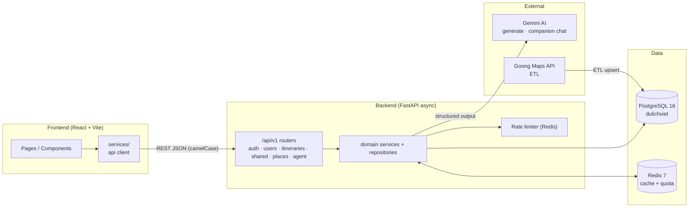

# 🗺️ DuLichViet — AI Travel Itinerary Recommendation System

<div align="center">


**NT208 · Web Programming Project · UIT 2023.2**

</div>

---

> 📖 Đây là **landing page** của dự án. Tài liệu kỹ thuật chi tiết (kiến trúc, backend, frontend, database/ETL, AI, testing, deploy) nằm trong [`docs/`](docs/INDEX.md). README backend/frontend riêng ở [`Backend/README.md`](Backend/README.md) và [`Frontend/README.md`](Frontend/README.md).

## 📖 Mô tả

**DuLichViet** là hệ thống gợi ý và lập kế hoạch chuyến đi thông minh dành riêng cho du lịch Việt Nam. Người dùng chỉ cần mô tả điểm đến, ngân sách và sở thích — hệ thống AI sẽ tự động sinh ra lịch trình chi tiết theo từng ngày, bao gồm các hoạt động, địa điểm ăn uống, tham quan và chỗ ở phù hợp.

Lịch trình được tạo ra dựa trên dữ liệu địa điểm thực tế từ Goong Maps API, sau đó được Gemini AI sắp xếp thành hành trình hợp lý. Người dùng có thể chỉnh sửa thủ công, chia sẻ qua link công khai, hoặc đánh giá sau chuyến đi. Khách vãng lai (guest) có thể tạo lịch trình ngay mà không cần đăng ký, và claim về tài khoản sau khi đăng nhập.

**Điểm nổi bật:**
- 🤖 AI sinh lịch trình từ DB recommendation context — không hallucinate địa điểm
- 💬 Companion chat trip-bound: AI đề xuất chỉnh sửa (`proposedOperations`) → user xác nhận (`apply-patch`) mới ghi DB
- 🔒 Bảo mật token: refresh rotation, share/claim token hash SHA-256, không lưu raw token
- ⚡ Optimistic update trên FE — UI phản hồi ngay, revert nếu API fail
- 🗄️ Redis cache cho places/destinations; rate limit AI **fail-closed** (Redis down thì block, không bypass)
- 📡 ETL Goong-first nạp địa điểm thật vào PostgreSQL (28 thành phố)

---

## ✨ Tính năng chính

| Nhóm | Tính năng | Trạng thái |
|---|---|---|
| **Auth** | Đăng ký / đăng nhập / đăng xuất, refresh token rotation (JWT) | ✅ Done |
| **Auth** | Quên mật khẩu / đặt lại qua email, đổi mật khẩu | ✅ Done |
| **Profile** | Xem / cập nhật hồ sơ | ✅ Done |
| **Trip** | Tạo lịch trình thủ công + auto-save ngày / hoạt động / chỗ ở | ✅ Done |
| **Trip** | Xem / xóa / đánh giá lịch trình | ✅ Done |
| **Trip** | Chia sẻ qua link công khai (shareToken) | ✅ Done |
| **Trip** | Guest tạo trip → claim về tài khoản sau đăng nhập (claimToken one-time) | ✅ Done |
| **Places** | Tìm kiếm địa điểm theo thành phố / danh mục, lưu địa điểm yêu thích | ✅ Done |
| **AI C.1** | Sinh lịch trình tự động bằng Gemini (direct pipeline, structured output) | ✅ Done |
| **AI C.2** | Gợi ý địa điểm thay thế (DB-only, không LLM) — BE done | ✅ Done |
| **AI C.3A** | Chat session foundation (owner-only, trip-scoped) | ✅ Done |
| **AI C.3B/C.3C** | Companion chat message flow + apply-patch confirm | ✅ Done |
| **AI C.4** | Chat history persisted + quản lý session (rename/delete/switcher) | ✅ Done |
| **AI C.5** | Analytics Text-to-SQL | 🔄 Optional/deferred |
| **ETL** | Goong-first ETL nạp dữ liệu địa điểm (28 thành phố, scheduler opt-in) | ✅ Done |

> Chi tiết từng phase (branch/PR/endpoint): [`docs/11_phase_roadmap.md`](docs/11_phase_roadmap.md) · [`docs/06_ai_roadmap.md`](docs/06_ai_roadmap.md)

---

## 🛠️ Tech Stack

### Backend

| Thành phần | Công nghệ | Phiên bản |
|---|---|---|
| Framework | FastAPI | 0.115+ |
| Language | Python | 3.12+ |
| Package Manager | uv | 0.4+ |
| ORM | SQLAlchemy (async) | 2.0+ |
| Database | PostgreSQL | 16 |
| Migration | Alembic | 1.14+ |
| Cache | Redis | 7 |
| Auth | JWT (python-jose) + bcrypt | — |
| AI | Google Gemini (google-genai SDK) | gemini-2.5-flash |
| HTTP Client | httpx | 0.28+ |
| Email | aiosmtplib | 3.0+ |
| Logging | structlog | 24.4+ |
| Validation | Pydantic v2 | 2.10+ |
| Lint/Format | Ruff | 0.8+ |
| Test | pytest + pytest-asyncio | — |

### Frontend

| Thành phần | Công nghệ | Phiên bản |
|---|---|---|
| Framework | React | 18.3 |
| Language | TypeScript | 5 |
| Build Tool | Vite | 6.4 |
| Styling | TailwindCSS | 4.1 |
| UI Components | MUI + Radix UI | 7.x / latest |
| Icons | Lucide React | 0.487 |
| Routing | React Router | 7.13 |
| Charts | Recharts | 2.15 |
| Drag & Drop | React DnD | 16 |
| Animation | Motion | 12 |
| E2E Testing | Playwright | 1.59+ |

### Infrastructure

| Thành phần | Công nghệ |
|---|---|
| Container | Docker + Docker Compose |
| CI/CD | GitHub Actions (7 required checks) |
| Maps/ETL | Goong Maps API |
| AI Provider | Google AI Studio (Gemini) |

---

## 🏗️ Tổng quan kiến trúc



- **Public contract** trả `camelCase` (source of truth: [`Frontend/src/app/types/trip.types.ts`](Frontend/src/app/types/trip.types.ts)).
- **Generate** đi **direct pipeline** (`ItineraryPipeline`), không qua Supervisor.
- **Companion chat** trả `requiresConfirmation` + `proposedOperations`; **không tự persist** — chỉ `apply-patch` sau user confirm mới ghi DB.
- **Rate limit AI fail-closed**: Redis down → 503, không cho bypass.

📖 Đầy đủ kiến trúc / luồng dữ liệu / bảo mật / thiết kế: [`docs/02_architecture.md`](docs/02_architecture.md)

---

## 📁 Cấu trúc repo

```text
NT208-ai-travel-itinerary-recommendation-system/
├── Backend/
│   ├── src/
│   │   ├── main.py                # App factory, /api/v1 routers, /health
│   │   ├── auth/                  # Auth + users (register, login, refresh, profile, reset)
│   │   ├── itineraries/           # Trip CRUD, generate pipeline, share/claim, companion chat
│   │   ├── places/                # Destinations, places, hotels, saved places
│   │   ├── agent/                 # AI infra chung (LLM client, prompts, schemas)
│   │   ├── etl/                   # Goong-first ETL (extractors/transformers/loaders/scheduler)
│   │   ├── geo/                   # Goong REST client
│   │   ├── core/                  # config, db, security, dependencies, middleware, rate limiter
│   │   └── shared/                # cache client, pagination, base helpers
│   ├── tests/                     # 187 unit + 77 integration (collect)
│   ├── alembic/versions/          # 13 migrations
│   ├── config.yaml                # non-secret defaults
│   ├── .env.example               # secret template
│   ├── pyproject.toml             # uv deps + Ruff config
│   └── Dockerfile
├── Frontend/
│   ├── src/app/
│   │   ├── pages/                 # 26 page components
│   │   ├── components/            # shared + companion/ + ui/
│   │   ├── services/              # api.ts + auth/chat/itinerary/places/users
│   │   ├── hooks/ · contexts/ · types/ · data/ · utils/
│   ├── tests/e2e/                 # 17 Playwright spec files
│   ├── playwright.config.ts
│   ├── vite.config.ts · package.json
│   └── vercel.json                # SPA fallback rewrite
├── docs/                          # tài liệu kỹ thuật + REPORTS/
├── .claude/                       # context + skills cho Claude Code
├── docker-compose.yml             # api + db + redis (+ scheduler profile etl)
├── CLAUDE.md · AGENTS.md
└── README.md
```

📂 Chi tiết backend: [`Backend/README.md`](Backend/README.md) · [`docs/03_backend.md`](docs/03_backend.md)
📂 Chi tiết frontend: [`Frontend/README.md`](Frontend/README.md) · [`docs/04_frontend.md`](docs/04_frontend.md)
🗄️ Database/ETL/Redis: [`docs/05_database_etl.md`](docs/05_database_etl.md)

---

## 🚀 Quick Start

> 💡 **Local UAT:** [`docs/LOCAL_MANUAL_UAT_GUIDE.md`](docs/LOCAL_MANUAL_UAT_GUIDE.md) · User journey: [`docs/USER_JOURNEY_UAT.md`](docs/USER_JOURNEY_UAT.md)
> 🚀 **Staging deploy:** [`docs/STAGING_DEPLOYMENT_GUIDE.md`](docs/STAGING_DEPLOYMENT_GUIDE.md)

### Cách 1 — Docker Compose (khuyến nghị)

**Yêu cầu:** Docker Desktop đang chạy.

```bash
# 1. Clone repo
git clone https://github.com/<org>/NT208-ai-travel-itinerary-recommendation-system.git
cd NT208-ai-travel-itinerary-recommendation-system

# 2. Tạo file .env cho Backend (thêm JWT_SECRET_KEY, GEMINI_API_KEY, GOONG_API_KEY)
cp Backend/.env.example Backend/.env

# 3. Khởi động toàn bộ stack (api chạy alembic upgrade head rồi uvicorn)
docker compose up --build

# 4. (Optional) ETL nạp dữ liệu địa điểm
docker compose exec api python -m src.etl
```

Sau khi khởi động:
- **Frontend:** `http://localhost:5173`
- **Backend API:** `http://localhost:8000` · **Swagger:** `http://localhost:8000/docs`
- **Health check:** `http://localhost:8000/api/v1/health` → `{"status":"healthy"}`

### Cách 2 — Local Dev (Windows PowerShell, khuyến nghị khi dev hàng ngày)

**Yêu cầu:** Python 3.12+, Node.js 20+, Docker Desktop (cho PostgreSQL + Redis), `uv`, `npm`.

```powershell
$ROOT = git rev-parse --show-toplevel
Set-Location $ROOT

# 1) DB + Redis
docker compose up -d db redis
docker compose ps

# 2) Backend env (bắt buộc: JWT_SECRET_KEY; generate/ETL cần GEMINI_API_KEY + GOONG_API_KEY)
Set-Location "$ROOT\Backend"
if (-not (Test-Path .env)) { Copy-Item .env.example .env }
uv sync
uv run alembic upgrade head

# 3) ETL — nạp địa điểm thật từ Goong
uv run python -m src.etl --cities "Hà Nội" "TP. Hồ Chí Minh" "Đà Nẵng" "Hội An" "Huế" "Nha Trang" "Hạ Long" "Phú Quốc" "Sapa" "Đà Lạt"

# 4) Terminal Backend
$env:AGENT_TIMEOUT_SECONDS="120"
uv run uvicorn src.main:app --host localhost --port 8000 --reload

# 5) Terminal Frontend
Set-Location "$ROOT\Frontend"
npm ci
$env:VITE_API_URL="http://localhost:8000"
npm run dev -- --host localhost --port 5173
```

**Lưu ý dữ liệu thật vs fallback:**
- Places/hotels trong PostgreSQL là **nguồn thật** sau ETL Goong.
- Goong Place Detail **không trả URL ảnh/rating** — `places.image` có thể rỗng; FE dùng fallback có nhãn (giới hạn provider, không phải bug).
- Một số city sparse (ít place) trả `422` khi generate — đã có warning UI, không chặn submit.

---

## 📊 Tình trạng phát triển

| Phase | Nội dung | Trạng thái |
|---|---|---|
| Foundation | FastAPI async + uv + Alembic + Redis + Docker | ✅ Merged |
| Auth/Users | Register, login, refresh rotation, profile, password reset | ✅ Merged |
| Trip/Share/Claim | CRUD, nested data, share token, guest claim, rating | ✅ Merged |
| Places/Cache | Destinations, search/detail, saved places, Redis read cache | ✅ Merged |
| C.0 ETL | Goong-first ETL + scheduler (compose profile `etl`) | ✅ Merged |
| C.1 Generate | Direct pipeline DB context → Gemini structured output → persist | ✅ Merged |
| C.2 Suggestion | DB-only suggestion service (không LLM) | ✅ Merged |
| C.3A Chat session | Chat session REST APIs + FE ChatPanel | ✅ Merged (#98–100) |
| C.3B/C.3C Chat | Companion message flow + apply-patch confirm | ✅ Merged (#105) |
| C.4 History | Chat history + session management (rename/delete/switcher) | ✅ Merged (#106) |
| C.5 Analytics | Text-to-SQL | 🔄 Optional/deferred |

**HEAD hiện tại:** `fix: [#00136] integrate goong map and backfill trip image snapshots (#128)` — Phase C.1–C.4 đã merge hoàn chỉnh; gần đây thêm hardening runtime ảnh + tích hợp bản đồ Goong thật ở DailyItinerary (PR #127/#128); C.5 Analytics là tùy chọn (chưa implement, cần guardrails bảo mật nếu bật).

> Mọi chi tiết phase/branch/PR: [`docs/11_phase_roadmap.md`](docs/11_phase_roadmap.md) · Tracker: [`docs/09_execution_tracker.md`](docs/09_execution_tracker.md)

---

## 🧪 Testing

| Layer | Số lượng | Cách chạy |
|---|---|---|
| Backend unit | 187 tests | `cd Backend && uv run pytest tests/unit -v` |
| Backend integration | 77 collected (43 pass + 34 CI-gated skip local) | `cd Backend && uv run pytest tests/integration -v` |
| Frontend build | production bundle | `cd Frontend && npm run build` |
| Frontend e2e | 17 spec files / 36 tests (Playwright) | `cd Frontend && npm run test:e2e` |

**CI (GitHub Actions) — 7 required checks:** `pr-policy`, `backend-lint`, `backend-unit`, `backend-integration`, `backend-migrations`, `frontend-build`, `frontend-e2e`.

> ⚠️ Integration tests skip 34 case local vì cần PostgreSQL thật (CI-gated); chạy đủ trên CI postgres. E2E cần BE đang chạy trên `localhost:8000`.

📖 Chi tiết: [`docs/08_testing_local_run.md`](docs/08_testing_local_run.md) · [`docs/10_automation_testing_report.md`](docs/10_automation_testing_report.md)

---

## ☁️ Deployment

- **Frontend:** Vercel (Vite SPA, `vercel.json` có rewrite). Build env: `VITE_API_URL` = URL backend prod; `VITE_GOONG_MAP_API_KEY` = Goong map-tiles public key (cho tab "Bản đồ" ở DailyItinerary, PR #128).
- **Backend:** Render native Python (`uvicorn ... --port $PORT`, health `/api/v1/health`), hoặc Docker fallback.
- **Postgres:** Render Postgres (khuyến nghị) hoặc Supabase.
- **Redis:** Render Key Value / TCP provider (bắt buộc — app dùng Redis TCP client, **không** Upstash REST).
- **Migrations:** tự chạy qua `preDeployCommand` trong `render.yaml` (Render chạy `alembic upgrade head` sau build, trước uvicorn, mỗi deploy — free tier OK, không cần Render Shell).

📖 Runbook đầy đủ (env/secrets/ports/provider): [`docs/STAGING_DEPLOYMENT_GUIDE.md`](docs/STAGING_DEPLOYMENT_GUIDE.md)

---

## 📚 Tài liệu chi tiết

Bộ tài liệu kỹ thuật tiếng Việt đầy đủ nằm trong [`docs/`](docs/INDEX.md):

| Tài liệu | Nội dung |
|---|---|
| [`docs/01_overview.md`](docs/01_overview.md) | Tổng quan sản phẩm, use case, thành phần |
| [`docs/02_architecture.md`](docs/02_architecture.md) | Kiến trúc hệ thống, data flow, bảo mật |
| [`docs/03_backend.md`](docs/03_backend.md) | Kiến trúc backend, API, services, repositories |
| [`docs/04_frontend.md`](docs/04_frontend.md) | Kiến trúc frontend, pages, components, API client |
| [`docs/05_database_etl.md`](docs/05_database_etl.md) | Database, Redis, ETL Goong, schema, migrations |
| [`docs/06_ai_roadmap.md`](docs/06_ai_roadmap.md) | Kiến trúc AI/Gemini, generate, companion chat, C.5 |
| [`docs/07_workflow_ci.md`](docs/07_workflow_ci.md) | Workflow phát triển, branch/commit/PR, CI |
| [`docs/08_testing_local_run.md`](docs/08_testing_local_run.md) | Testing + xác minh local (PowerShell) |
| [`docs/STAGING_DEPLOYMENT_GUIDE.md`](docs/STAGING_DEPLOYMENT_GUIDE.md) | Runbook deploy staging/prod |
| [`docs/INDEX.md`](docs/INDEX.md) | Mục lục tài liệu đầy đủ |

---

## 👥 Team

**NT208 — Web Programming · UIT 2023.2**

| Thành viên | MSSV | Vai trò | Đóng góp |
|---|---|---|---|
| Bùi Nhật Anh Khôi | 23520761 | Leader, Backend, AI | 25% |
| Dương Đăng Chính | 24520222 | Frontend | 25% |
| Lê Văn Chí | 24520214 | Backend | 25% |
| Nguyễn Hữu Chiến | 24520218 | Backend | 25% |

---

## 🔗 Video / Demo / Public Links

Tất cả các đường dẫn dưới đây phải truy cập được công khai tại thời điểm nộp bài:

- Full source code: `<điền link GitHub public của project>`
- Video demo tính năng mới nhất hoặc full demo tính năng: `<điền link video public, tối đa 5 phút/video>`
- Video khảo sát user: `<điền link nếu có>`
- Ảnh chụp minh chứng cộng điểm / tài nguyên bổ sung: `<điền link nếu có>`
- Report hoặc slide bổ sung: `<điền link nếu có>`

---

Chúng em đã biết làm web và hiểu hệ thống web hoạt động như thế nào.
