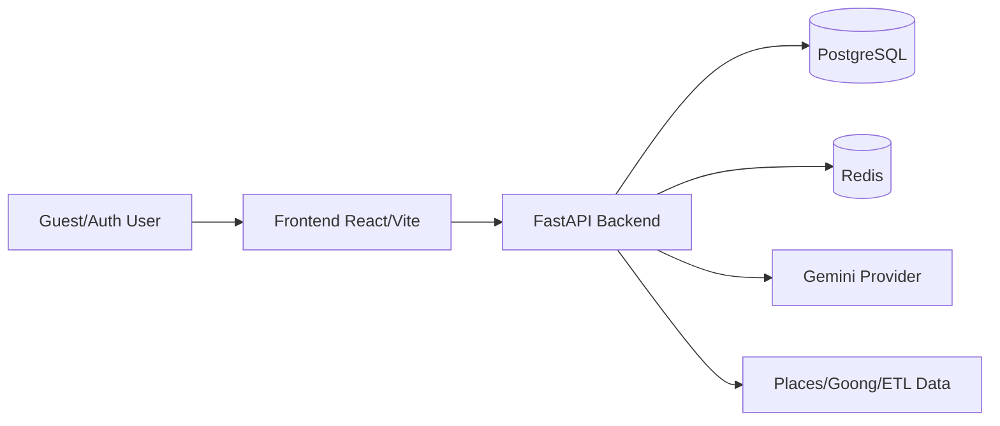
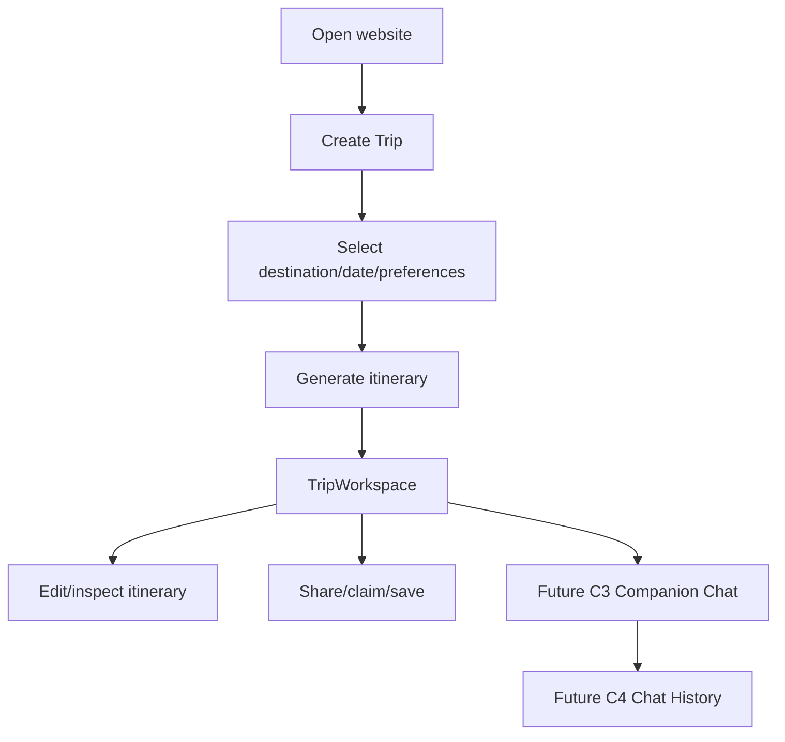

# Architecture Review and C3/C4 Readiness

Ngày cập nhật: 2026-06-03

## Mục tiêu

Tài liệu này trả lời câu hỏi: hệ thống hiện tại đã đủ rõ, đủ an toàn, và đủ ổn để bắt đầu `C3` và `C4` đến mức nào.

Kết luận ngắn:

- `C3` không phải chatbot du lịch chung chung; nó phải bám vào `TripWorkspace`.
- `C4` không phải lịch sử chat toàn cục; nó phải gắn theo `trip`, `session`, và `owner`.
- Có thể bắt đầu `C3A — Chat Session Foundation`.
- Chưa nên nhảy thẳng vào `C3B` hoặc `C4` khi API foundation, quota policy, và patch contract chưa được khóa.

## Product Problem and End-user Flow

### Product goal

Sản phẩm này giúp người dùng tạo và quản lý lịch trình du lịch thông minh tại Việt Nam bằng AI:

- chọn điểm đến
- chọn khoảng ngày
- nhập sở thích, ngân sách, thời lượng, số người
- generate itinerary
- mở `TripWorkspace`
- chỉnh sửa, xem chi tiết, claim, share, lưu trip
- hiểu rõ quota và lỗi khi có sự cố

C3/C4 chỉ có ý nghĩa nếu tiếp tục phục vụ đúng flow trên, thay vì biến sản phẩm thành chatbot du lịch tách rời itinerary.

### Main personas

| Persona | Goal | Important flows |
|---|---|---|
| Guest user | Thử tạo trip nhanh mà chưa cần đăng nhập ngay | mở home → create trip → generate → xem workspace trong cùng browser session → login/register khi muốn claim và giữ ownership lâu dài |
| Auth user | Tạo và quản lý trip của riêng mình lâu dài | login → generate/create trip → workspace → edit → share → trip library |
| Returning user | Quay lại trip cũ để xem/chỉnh/sau này chat tiếp | login → trip library → mở workspace → tiếp tục thao tác trên trip đã có |
| Shared-link viewer | Chỉ xem trip được chia sẻ | mở `/shared/:token` → xem read-only itinerary |

### Core journeys

| Journey | Current behavior | Evidence | C3/C4 implication |
|---|---|---|---|
| Guest create trip | Guest có thể tạo trip, nhận `claimToken`, lưu thêm `currentTrip` trong `sessionStorage`, và mở `TripWorkspace` trong cùng browser session trước khi claim | `00059C`, `00060H`, `AuthContext`, `CreateTrip.tsx`, `useTripSync`, `service.py` | Guest vẫn chưa đủ điều kiện vào owner chat; chat không nên chạy trước claim/auth |
| Auth generate trip | Auth user generate xong đi thẳng vào workspace owner-only | `00059C`, `CreateTrip.tsx`, `router.py`, `pipeline.py` | C3 nên xuất hiện sau khi trip đã tồn tại |
| TripWorkspace usage | Workspace đã load trip thật, edit activities/accommodations, save state | `00059C`, `TripWorkspace.tsx`, `useTripSync`, `00060A` | Đây là anchor chính cho C3 |
| Claim trip | Guest trip được claim sau login/register | `00059C`, `AuthContext`, `service.py` | C3A nên yêu cầu claim xong mới tạo session |
| Share trip | Share token public read-only hoạt động riêng | `00059C`, `SharedTripView.tsx`, `share` endpoints | Shared viewer không nên có chat history/chat session mặc định |
| Quota/error UX | FE đã có mapping 401/403/422/429/503; generate quota có contract header/body | `errorHandler.ts`, `api.ts`, `00058B`, `00059C` | Chat cần reuse contract này thay vì tự phát minh UX mới |

### Core statement for C3/C4

- `C3` phải giúp user bên trong một trip/workspace hiện có, không phải chatbot du lịch chung chung.
- `C4` phải giữ lịch sử hội thoại theo `trip` và `session`, không phải inbox chat toàn app.

## 6.1 System overview

| Component | Role | C3/C4 relevance |
|---|---|---|
| Guest/Auth User | Người dùng tạo, xem, sửa, claim, share trip | Chat chỉ có ý nghĩa khi người dùng đang đứng trong một trip cụ thể |
| Frontend React/Vite | Hiển thị CreateTrip, TripWorkspace, TripLibrary, SharedTripView, auth/profile | `TripWorkspace` là chỗ tự nhiên nhất để gắn ChatPanel |
| FastAPI Backend | Auth, generate, trip CRUD, share, claim, places, AI orchestration | Sẽ phải giữ ownership-safe cho chat session/message giống trip CRUD |
| PostgreSQL | Lưu user, trip, day, activity, accommodation, share/claim token, chat schema | `chat_sessions` và `chat_messages` đã có schema sẵn |
| Redis | Cache places và quota/rate-limit AI | Chat quota phải fail-closed giống generate khi Redis lỗi |
| Gemini Provider | Sinh itinerary AI hiện tại | C3B mới gọi AI thật; C3A không cần gọi provider |
| Places/Goong/ETL Data | Nguồn dữ liệu điểm đến/khách sạn cho generate và gợi ý | Chat muốn trả lời tốt phải dùng itinerary context hiện có, không phụ thuộc hoàn toàn vào provider |

## 6.2 Current user flow diagram

Giải thích ngắn:

- Hệ thống hiện tại đã có đường đi end-user đủ rõ từ `CreateTrip` sang `TripWorkspace`.
- Chat phải sống bên trong `TripWorkspace`, vì đó là nơi user xem và chỉnh itinerary hiện tại.
- Lịch sử chat phải là lịch sử của trip/session đó, không phải hộp chat toàn site.

## 6.3 Frontend architecture

### Routes và page shape hiện tại

| Area | Current truth | C3/C4 implication |
|---|---|---|
| Public routes | `/`, `/cities`, `/cities/:slug`, `/create-trip`, `/shared/:token`, auth pages | Shared view là public read-only, không nên có chat |
| Protected routes | `/trip-library`, `/trip-workspace`, `/profile`, `/saved-places`, các trang user-only | Chat session nên được tạo và đọc trong protected trip routes |
| CreateTrip | Dùng backend destinations + calendar + generate API; guest flow lưu `pendingClaim` + `currentTrip`, rồi vào workspace trong cùng browser session | Chat không nên bắt đầu từ CreateTrip; nó bắt đầu sau khi trip đã tồn tại |
| TripLibrary/MyTrips | Liệt kê trip owner-only | Có thể là nơi vào lại các trip có chat session cũ |
| SharedTripView | Dùng share token, chỉ xem read-only | Không public chat history theo share link nếu chưa có thiết kế riêng |

### Auth/session

| Concern | Current truth | C3/C4 implication |
|---|---|---|
| AuthContext | Lưu access/refresh token, tự refresh, claim pending guest trip sau login/register | Chat nên dùng đúng auth context hiện tại, không tạo auth flow riêng |
| Pending guest claim | `sessionStorage` giữ `{tripId, claimToken}` để claim sau auth, và `currentTrip` giữ snapshot itinerary cho cùng browser session | Theo invariant hiện tại, guest phải claim trip rồi mới được chat |
| ProtectedRoute | Chặn phần lớn owner routes nếu chưa auth, nhưng cho guest mở `TripWorkspace` khi có local session trip hợp lệ | C3A nên reuse đúng boundary này: guest được xem local workspace, nhưng chat session vẫn là owner-only |

### API client và error handling

| Concern | Current truth | C3/C4 implication |
|---|---|---|
| `services/api.ts` | Tự gắn bearer token, refresh 401, parse rate-limit headers | Chat API nên dùng cùng client để có 401 retry và 429 metadata |
| `errorHandler.ts` | Có mapping cho 401/403/422/429/503/network | Chat UI nên reuse cách hiển thị lỗi hiện có, không tạo wording mâu thuẫn |

### CreateTrip, destination, calendar

| Concern | Current truth | C3/C4 implication |
|---|---|---|
| Destination readiness | Advisory-only, không block partial city | Chat cần nói dựa trên itinerary/trip hiện có, không tự biến thành validator dữ liệu đầu vào |
| Calendar flow | Đã ổn định sau 00059A | Không phải blocker cho C3/C4 |

### TripWorkspace

`TripWorkspace.tsx` hiện là điểm trung tâm của product workflow:

- nhận `tripId` từ query string
- load dữ liệu trip thật
- quản lý `days`, `activities`, `accommodations`, `budget`, `travelers`, `tripName`
- gọi `useTripSync`, `useActivityManager`, `useAccommodation`, `usePlacesManager`

Đây là điểm gắn C3 tốt nhất vì chat cần:

- `tripId`
- itinerary hiện tại
- trạng thái edit/save hiện tại
- owner auth state
- error/loading states đã tồn tại

### Current chat placeholder

`FloatingAIChat.tsx` hiện là mock:

- local state-only
- không gọi API
- quick replies cứng
- từ `00060D-FIX`, `selectedCities` đã derive từ trip hiện tại thay vì hardcode `Hà Nội`

Điều này chứng minh:

- repo đã có vị trí UI cho chat
- context bug trước `C3A` đã được fix ở mức UI shell
- nhưng chưa có wiring thật theo `tripId`, session, và API chat thật
- C3A nên thay mock này bằng ChatPanel/session-aware foundation, chưa cần AI thật

### Recommended FE insertion for C3

| Item | Recommendation |
|---|---|
| Main container | Gắn `ChatPanel` vào `TripWorkspace` thay cho mock `FloatingAIChat` |
| Required props | `tripId`, `tripName`, `destination`, `days`, `accommodations`, `isAuthenticated` |
| Required states | session loading, create-session empty state, 401/403/429/503 error state |
| Not in scope for C3A | AI reply streaming, WebSocket, global chat launcher, shared-view chat |

## 6.4 Backend architecture

| Area | Current truth | C3/C4 implication |
|---|---|---|
| Routers | `auth`, `itineraries`, `places`, `agent` | Chat REST nên nằm trong `itineraries` vì nó là trip-bound |
| Services | `AuthService`, `ItineraryService`, `PlaceService`, `SuggestionService`, `ItineraryPipeline` | `CompanionService` nên nằm trong `Backend/src/itineraries/`, không nằm ở `src/agent/` |
| Repositories | `itineraries/repository.py` đã chịu trách nhiệm CRUD + AI context queries | Chat queries nên mở rộng cùng trip repository/chat repo theo trip ownership |
| Models/Schemas | Trip domain và auth domain đã tách rõ; chat schema đã tồn tại | Không cần vẽ lại data model từ số 0 cho C3A |
| Auth/JWT/refresh | Đã hoạt động, có access/refresh, profile, logout | Chat API nên dùng cùng auth stack, không được bypass |
| Guest identity/claim | Guest generate/manual create có `claimToken`, `currentTrip` local session, claim sau login/register | Theo invariant hiện tại, guest chưa claim thì không được chat |
| Trip/itinerary CRUD | Owner-only, shared view public read-only | Chat session/message phải kế thừa rule owner-only |
| Share | Share token public để xem trip read-only | Không tự suy diễn shared viewer có quyền chat |
| Rate-limit/quota | Redis-backed AI limit, fail-closed khi Redis down | Chat phải có quota riêng hoặc namespace riêng; không reuse mù generate quota |
| Generate pipeline | Direct `ItineraryPipeline`, không qua Supervisor | C3B có thể reuse AI infra (`agent/llm.py`) nhưng chat context phải lấy từ trip hiện tại |
| Ownership after 00060A | Mixed-ID nested mutation exploit đã bị chặn bằng trip-bound lookup | Đây là nền tảng để tin cậy patch/apply-patch sau này |

### Architectural placement for C3/C4

| Layer | Recommended location |
|---|---|
| Chat session REST | `Backend/src/itineraries/router.py` |
| Companion business logic | `Backend/src/itineraries/companion_service.py` |
| Chat persistence service | `Backend/src/itineraries/service.py` hiện giữ session foundation; `companion_service.py` hoặc layer riêng sẽ nhận phần message/history khi sang C3B/C4 |
| Shared AI infra | `Backend/src/agent/llm.py`, prompts, schemas |
| Patch apply logic | `Backend/src/itineraries/service.py` or dedicated companion patch service, but still under `itineraries/` |

## 6.5 Data model review

### Current entities relevant to product

| Entity | Current role |
|---|---|
| `User` | Chủ sở hữu trip, auth principal |
| `Trip` | Root aggregate cho toàn bộ itinerary |
| `TripDay` | Các ngày trong trip |
| `Activity` | Các hoạt động theo từng ngày |
| `Accommodation` | Nơi ở gắn với trip |
| `Destination` / `Place` / `Hotel` | Dữ liệu recommendation/places |
| `ShareLink` | Public read-only share token |
| `GuestClaimToken` | Claim trip guest sang auth user |
| Rate-limit Redis keys | Quota AI theo actor/date |
| `ChatSession` | Đã có schema, gắn `trip_id`, `user_id`, `thread_id`, `status` |
| `ChatMessage` | Đã có schema, gắn `session_id`, `role`, `content`, `proposed_operations`, `requires_confirmation` |

### Current truth quan trọng

`chat_sessions` và `chat_messages` đã tồn tại trong source và migration hiện tại. Vì vậy:

- `C3A` không nhất thiết phải tạo bảng mới từ đầu
- phase foundation có thể tập trung vào ownership-safe API và FE insertion
- chỉ cần migration mới nếu sau review thấy thiếu field/index/constraint

### Proposed C3/C4 entities and rules

| Entity | Purpose | Key fields | Ownership rule | Why needed |
|---|---|---|---|---|
| `ChatSession` | Gom một cuộc hội thoại theo trip | `id`, `trip_id`, `user_id`, `thread_id`, `status`, timestamps | user phải là owner của `trip_id`; shared viewer không có quyền | Session là đơn vị cơ bản để vào C3A/C4A |
| `ChatMessage` | Lưu từng lượt user/assistant | `id`, `session_id`, `role`, `content`, `proposed_operations`, `requires_confirmation`, `created_at` | session phải thuộc user hiện tại và thuộc trip hiện tại | Cần cho C3B và C4 history |
| `ChatUsage` (optional) | Theo dõi usage/cost/quota chat | `id`, `session_id`, `user_id`, `message_count`, `provider_calls`, `day_key` | owner-only, internal-only | Nếu muốn tách quota/cost audit khỏi generate |
| `ChatRateLimit` (optional logical model) | Tách namespace quota chat | Redis key hoặc table pointer theo `user/day` | auth user only; guest policy explicit | Tránh chat ăn chung quota generate |
| `ChatContextSnapshot` (optional, later) | Lưu snapshot itinerary/context tại lúc chat | `session_id`, `trip_version`, serialized context summary | owner-only | Hữu ích cho debug/replay, không bắt buộc cho C3A |

### Data-model recommendation

- Dùng luôn `ChatSession` + `ChatMessage` hiện có cho `C3A`.
- Không thêm `guest_user_id` hoặc guest session logic trong `C3A`.
- Chỉ cân nhắc migration khi cần:
  - thêm index phục vụ list/history nhanh
  - thêm soft-delete/archive semantics rõ hơn
  - thêm version/snapshot support cho patch conflict về sau

## 6.6 Security/ownership review

| Concern | Current truth | Recommendation for C3/C4 |
|---|---|---|
| Trip ownership | `GET/PUT/DELETE /itineraries/{tripId}` là owner-only | Chat session phải bám theo trip owner |
| Nested subresource ownership | 00060A đã chặn mixed-ID exploit | Patch/apply-patch sau này phải dùng cùng trip-bound validation |
| Chat session ownership | Chưa có API nhưng schema có `trip_id`, `user_id` | `user_id` của session phải khớp owner hiện tại khi tạo/đọc |
| Chat message ownership | Chưa có API | Chỉ đọc/ghi message qua session mà session thuộc owner |
| Share-link behavior | Public read-only qua `/shared/{token}` | Chat không public theo share link mặc định |
| Guest behavior | Guest tạo trip rồi claim sau auth | Guest phải claim trip trước khi chat |
| Cross-user denial | Existing owner-only trip rules + 00060A fix đã ổn | C3A/C4 phải trả 403/404 nhất quán cho cross-user session/message access |

### Security decision

- `C3A`: auth user only, owner-only, share viewer no-access
- `C3B`: giữ same rule, cộng thêm provider quota, patch confirm, no auto-persist
- `C4`: list/history vẫn owner-only; không có public history

## 6.7 Rate-limit/cost review

### Nên dùng cùng quota với generate không?

Khuyến nghị: **Không**.

Lý do:

- generate là thao tác nặng, ít lần, cost cao
- chat là thao tác nhẹ nhưng lặp lại nhiều lần
- nếu dùng chung quota `3/day`, user có thể hết quota generate rồi chat bị vô hiệu hóa ngay trong workspace

Namespace hiện tại của generate vẫn là:

- `rate:ai:user:{id}:{YYYYMMDD}`
- `rate:ai:guest:{hash}:{YYYYMMDD}`

Khuyến nghị cho `C3B`:

- `rate:ai:generate:user:{id}:{YYYYMMDD}`
- `rate:ai:generate:guest:{hash}:{YYYYMMDD}`
- `rate:ai:chat:user:{id}:{YYYYMMDD}`

### Guest chat có nên được phép không?

Khuyến nghị cho `C3A` và `C3B`: **Không**.

Lý do:

- repo invariant hiện tại nói rõ guest phải claim trip trước khi chat
- giúp đơn giản ownership model
- tránh abuse guest spam AI bằng fingerprint vốn đã là control nhẹ hơn auth user

### Ngăn chat spam đốt cost thế nào?

Khuyến nghị:

1. tách Redis namespace quota chat riêng khỏi generate
2. fail-closed khi Redis down giống generate
3. giới hạn message/day hoặc message/hour cho auth user
4. chặn double-send ở FE
5. chỉ gọi provider khi session/trip/context hợp lệ

### Header/429 UX kỳ vọng

Chat nên reuse contract đã có:

- `X-RateLimit-Limit`
- `X-RateLimit-Remaining`
- `X-RateLimit-Reset`
- `Retry-After` khi `429`

FE chat nên hiển thị:

- vì sao bị chặn
- khi nào reset
- đây là quota chat, không nhầm với generate

## 6.8 Error UX review

| Case | Current system behavior | C3/C4 implication |
|---|---|---|
| `401` | API client tự thử refresh rồi retry | Chat panel nên reuse toàn bộ flow này |
| `403` | Owner mismatch bị chặn rõ | Dùng cho trip/session owner mismatch nếu project convention cần |
| `422` | Error handler đã có mapping | Chat request invalid phải trả message actionable, không generic |
| `429` | Generate đã có header/body contract rõ | Chat phải có quota contract tương tự nhưng namespace khác |
| `503` | Generate/provider/Redis down đã có direction xử lý | Chat phải hiển thị “AI tạm unavailable” thân thiện, không treo UI |
| AI timeout | Generate reports đã ghi nhận partial/live risk | Chat cần timeout copy rõ và retry strategy |
| Provider unavailable | Chưa full live-proof trong phase gần nhất | C3B tests phải dùng fake provider, live smoke tách riêng |
| Network error | FE hiện có generic network handling | Chat panel nên có retry nút/thông điệp rõ ràng |

## C3/C4 Readiness Decision

| Category | Status | Evidence | Risk |
|---|---|---|---|
| End-user UAT | READY_FOR_REVIEW | 00059C đã test browser/manual các flow chính | real provider path vẫn partial |
| Auth/ownership | READY_WITH_FIXED_BLOCKER | 00060A đã resolve nested authz gap | chat session ownership chưa có API |
| TripWorkspace stability | READY | Workspace load/edit/share đã có evidence | chat panel hiện vẫn là mock |
| Generate pipeline | PARTIAL_BUT_ACCEPTABLE_FOR_C3A | C.1 đã chạy, older smoke có real generate; latest manual UAT giữ policy không gọi provider thật | C3B không nên dựa vào live provider ngay |
| Guest workspace continuity | READY_WITH_BOUNDARY | `00060H` đã verify guest generate có thể mở `TripWorkspace` qua `sessionStorage.currentTrip`, không ép login ngay | Chat session vẫn phải owner-only sau claim/auth |
| Rate-limit/quota | PARTIAL | generate quota có sẵn; chat quota riêng chưa có | nếu reuse quota chung sẽ gây UX tệ |
| Error UX | PARTIAL_READY | FE đã có error mapping cho 401/403/422/429/503 | chat-specific copy và retry UX chưa có |
| Data model readiness | READY_FOR_C3A | chat tables đã có trong source/migration | docs ETL/migration history còn drift |
| Test coverage | READY_FOR_FOUNDATION_ONLY | 00059C + 00060A có evidence tốt | chat/session tests chưa tồn tại vì feature chưa implement |

### Decision

**GO_WITH_LIMITATIONS**

### Direct answers

- Can start `C3A`? **YES**
- Can start `C3B` directly? **NO**
- Can start `C4` directly? **NO**

### Why

`C3A` an toàn để bắt đầu vì:

- trip ownership hiện tại đã đủ tin cậy sau `00060A`
- `TripWorkspace` đã là điểm neo đúng của product
- chat schema đã tồn tại
- không cần gọi AI thật

`C3B` và `C4` chưa nên nhảy thẳng vào vì:

- message send/history API ownership chưa được dựng
- chat quota riêng chưa chốt
- patch-confirm/stale handling mới chỉ là design issue
- FE companion thật mới dừng ở `ChatPanel` session CRUD; message UX và companion flow vẫn chưa bám dữ liệu thật

## Drift and follow-up notes

| Item | Finding | Impact |
|---|---|---|
| `docs/05_database_etl.md` migration history | Đã được sync ở `00060C`; chat tables hiện được ghi đúng là nằm trong initial schema trên `main` | Không còn là drift blocker cho C3A docs gate |
| `FloatingAIChat` | Đã có shell UI với fake replies; context bug hardcoded `Hà Nội` đã được fix pre-C3A nhưng panel vẫn chưa session-aware/API-backed | C3A cần thay mock bằng trip-aware panel foundation |
| Chat quota issue | Đã có issue mở `c3_chat_quota_shared_with_generate.md` | Không block `C3A`, block việc gọi AI thật nếu chưa chốt policy |
| Stale patch handling | Đã có issue mở `c3_stale_patch_handling_missing.md` | Không block `C3A`, nhưng ảnh hưởng `C3B/C3C` và future `apply-patch` |
